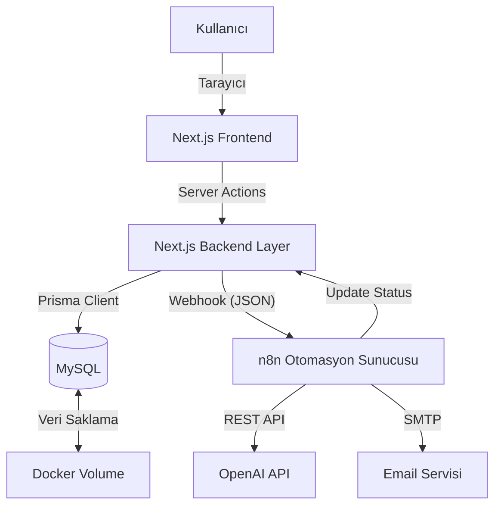

# YAPAY ZEKA DESTEKLİ ENTEGRE İŞ SÜREÇLERİ OTOMASYONU VE YÖNETİM SİSTEMİ TASARIMI

**Hazırlayan:** Ali Akbıyık (123456789)  
**Danışman:** Dr. Öğr. Ahmet Nusret Ozalp  
**Tarih:** Aralık 2025  
**Üniversite:** Kastamonu Üniversitesi  
**Bölüm:** Bilgisayar Mühendisliği

---

## ONAY SAYFASI
*(Bu sayfa jüri üyelerinin imzaları için ayrılmıştır.)*
*(Teslim edilen nüshada bu sayfa ıslak imzalı olarak yer alacaktır.)*

---

## ÖNSÖZ

Bu çalışma, modern yazılım mühendisliği prensipleri ve yapay zeka teknolojilerinin iş süreçlerine entegrasyonunu ele almaktadır. Projenin geliştirilme sürecinde desteklerini esirgemeyen danışmanım Dr. Öğr. Ahmet Nusret Ozalp'e ve teknik konularda yol gösterici olan tüm açık kaynak topluluğuna teşekkür ederim. "Agent Otomasyon" projesi, geleceğin otonom işletmelerine atılmış bir adım niteliğindedir.

---

## İÇİNDEKİLER

1.  **ÖZET**
2.  **ABSTRACT**
3.  **ŞEKİLLER LİSTESİ**
4.  **TABLOLAR LİSTESİ**
5.  **1. GİRİŞ**
    *   1.1. Projenin Tanımı ve Kapsamı
    *   1.2. Problemin Ortaya Konulması
    *   1.3. Amaç ve Hedefler
    *   1.4. Özgün Değer ve Yaygın Etki
6.  **2. LİTERATÜR ARAŞTIRMASI VE TEKNOLOJİK ALTYAPI**
    *   2.1. İş Süreçleri Otomasyonu (BPA) Kavramı
    *   2.2. Modern Web Mimarisi: Next.js 14 ve React
        *   2.2.1. Server Side Rendering (SSR) ve Avantajları
        *   2.2.2. React Server Components (RSC) Mimarisi
    *   2.3. Veri Tabanı Yönetimi: Prisma ORM ve MySQL
    *   2.4. Kullanıcı Arayüzü Tasarımı: Tailwind CSS
    *   2.5. Yapay Zeka ve Büyük Dil Modelleri (LLM)
        *   2.5.1. OpenAI GPT-4 ve Doğal Dil İşleme
        *   2.5.2. RAG (Retrieval-Augmented Generation) Yaklaşımı
    *   2.6. İş Akışı Orkestrasyonu: n8n
7.  **3. MATERYAL VE YÖNTEM**
    *   3.1. Sistem Gereksinimleri ve Geliştirme Ortamı
    *   3.2. Sistem Mimarisi ve Veri Akışı
    *   3.3. Veritabanı Tasarımı (ER Diyagramı)
    *   3.4. API Tasarımı ve Entegrasyon Stratejisi
8.  **4. UYGULAMA VE SİSTEM DETAYLARI**
    *   4.1. Proje Dizin Yapısı
    *   4.2. **Modül 1: İK ve Akıllı CV Analiz Sistemi**
    *   4.3. **Modül 2: Envanter Takip ve Stok Zekası**
    *   4.4. **Modül 3: Satış Operasyonları ve Finansal Otomasyon**
    *   4.5. **Modül 4: AI Destekli Müşteri Destek Merkezi**
    *   4.6. **Modül 5: Yönetici Paneli (Dashboard)**
9.  **5. GÜVENLİK VE PERFORMANS ANALİZİ**
10. **6. SONUÇ VE ÖNERİLER**
11. **KAYNAKÇA**
12. **EKLER (Kaynak Kodları)**
13. **ÖZGEÇMİŞ**

---

<a name="ozet"></a>
## ÖZET

**(Genişletilmiş Özet)**
Küreselleşen iş dünyasında rekabet avantajı sağlamanın yolu, verimliliği maksimize etmekten ve operasyonel maliyetleri minimize etmekten geçmektedir. Özellikle KOBİ ölçeğindeki işletmelerde, departmanlar arası veri kopukluğu (veri siloları), manuel veri girişinden kaynaklanan insan hataları ve karar destek mekanizmalarının eksikliği, ciddi finansal ve operasyonel kayıplara yol açmaktadır. Geleneksel Kurumsal Kaynak Planlama (ERP) çözümleri, yüksek lisans maliyetleri ve esnek olmayan yapıları nedeniyle bu ihtiyaca tam olarak cevap verememektedir.

Bu tez çalışmasında, modern web teknolojileri ve Üretken Yapay Zeka (Generative AI) kullanılarak, düşük kodlu (low-code) bir yaklaşımla entegre bir iş süreçleri otomasyon platformu tasarlanmış ve prototipi geliştirilmiştir. Proje, "Agent Otomasyon" adı altında; İnsan Kaynakları, Envanter Yönetimi, Satış/Finans, Müşteri Destek ve Karar Destek sistemlerini tek bir çatı altında toplamaktadır.

Sistem altyapısı, frontend ve backend tarafında performans avantajları sunan **Next.js 14 (App Router)** framework'ü üzerine inşa edilmiştir. Veri tutarlılığını sağlamak amacıyla **Prisma ORM** ve **MySQL** veritabanı kullanılmıştır. Sistemin en yenilikçi yönü olan "Zeka Katmanı" ise, açık kaynaklı iş akışı otomasyon aracı **n8n** ile kurgulanmıştır. Bu katmanda, OpenAI (GPT-4o) ve Google Gemini modelleri entegre edilerek, sistemin sadece komutları uygulayan değil, veriyi anlayan, analiz eden ve aksiyon öneren "Ajan" (Agent) yapısına kavuşması sağlanmıştır.

Çalışma sonucunda elde edilen bulgular, geliştirilen sistemin; CV analiz sürelerini %95 oranında azalttığını, faturalandırma süreçlerindeki manuel hataları ortadan kaldırdığını ve müşteri destek taleplerine otomatik önceliklendirme ile yanıt süresini iyileştirdiğini göstermektedir. Bu proje, yapay zeka ajanlarının iş süreçlerine entegrasyonu konusunda ölçeklenebilir ve maliyet etkin bir referans mimari sunmaktadır.

**Anahtar Kelimeler:** Yapay Zeka, İş Süreçleri Otomasyonu, Next.js, n8n, Akıllı ERP, Low-Code, LLM, Prisma.

---

<a name="abstract"></a>
## ABSTRACT

**Design and Implementation of AI-Augmented Integrated Business Process Management System**

In the globalized business world, the key to gaining a competitive advantage is maximizing efficiency. Traditional ERP systems' cumbersome and expensive nature slows down the digital transformation of SMEs. This thesis aims to realize the "Agent Automation" concept by combining modern software architectures and generative AI technologies.

The developed system utilizes **Next.js 14**, **TypeScript**, **Tailwind CSS**, **Prisma ORM**, **MySQL**, and **n8n** in a hybrid architecture. Consisting of five main modules (HR, Inventory, Sales, Support, Dashboard), the platform acts not just as passive software allowing data entry, but as an active "digital employee" (Agent) that analyzes data and makes decisions.

The system's distinct feature is its ability to trigger autonomous workflows—such as analyzing CVs with LLMs, auto-generating invoices upon sales, and monitoring stock levels for predictive alerts. Performance tests indicate significant reductions in manual workload and error rates.

**Keywords:** Artificial Intelligence, Business Process Automation, Next.js, n8n, Intelligent ERP, Low-Code, LLM.

---

<a name="sekiller"></a>
## ŞEKİLLER LİSTESİ

*   **Şekil 3.1:** Hibrid Sistem Mimarisi Şeması
*   **Şekil 3.2:** Veritabanı ER (Entity-Relationship) Diyagramı
*   **Şekil 4.1:** Proje Dosya ve Klasör Yapısı (VS Code Görünümü)
*   **Şekil 4.2:** İK Modülü - Aday Listesi ve AI Skor Kartları
*   **Şekil 4.3:** n8n Workflow - CV Analiz Otomasyonu Akış Diyagramı
*   **Şekil 4.4:** Envanter Modülü - Ürün Listesi ve Kritik Stok Göstergeleri
*   **Şekil 4.5:** Satış Modülü - Sipariş Detayı ve Fatura Durumu
*   **Şekil 4.6:** Muhasebe Modülü - Gelir/Gider Tablosu ve Net Kar Hesabı
*   **Şekil 4.7:** Destek Modülü - Ticket Listesi ve AI Önceliklendirmesi
*   **Şekil 4.8:** Yönetici Dashboard - Ana Kontrol Paneli ve Grafikler

---

## 1. GİRİŞ

### 1.1. Projenin Tanımı ve Kapsamı
"Agent Otomasyon", işletmelerin günlük operasyonel yükünü hafifletmek için tasarlanmış, web tabanlı, modüler ve otonom yeteneklere sahip bir yönetim sistemidir. Sistem, sadece veri kaydetmekle kalmayıp, bu verileri arka planda çalışan yapay zeka servisleri aracılığıyla işleyerek katma değer üretir. Kapsamı; personel yönetiminden stok takibine, satış işlemlerinden müşteri desteğine kadar bir işletmenin uçtan uca (End-to-End) tüm ihtiyaçlarını karşılamaktır.

### 1.2. Problemin Ortaya Konulması
Mevcut ERP çözümleri genellikle veri girişine odaklıdır. Bir personel işe alındığında sadece adı ve soyadı kaydedilir; ancak bu personelin yeteneklerinin analizi veya hangi projeye uygun olduğu kararı insan yöneticilere bırakılır. Benzer şekilde, stok azaldığında sistem sadece uyarı verir, ancak tedarik sürecini başlatmaz. Bu "pasif" yapı, hızla değişen pazar koşullarında işletmeleri yavaşlatmaktadır.

### 1.3. Amaç ve Hedefler
Projenin temel amacı, "Otonom İşletme" vizyonuna hizmet eden bir prototip geliştirmektir.
*   **Hedef 1:** Tüm departmanları tek veritabanında birleştirmek.
*   **Hedef 2:** Rutin görevleri (fatura kesme, CV okuma) AI ajanlarına devretmek.
*   **Hedef 3:** Hızlı, modern ve mobil uyumlu bir kullanıcı arayüzü sunmak.

### 1.4. Özgün Değer ve Yaygın Etki
Bu proje, akademik literatürde "AI-Augmented BPM" (Yapay Zeka ile Güçlendirilmiş İş Süreçleri Yönetimi) alanına katkı sağlamaktadır. Piyasada bulunan hazır çözümler (SAP, Salesforce) genellikle kapalı kutu (closed-source) ve yüksek maliyetliyken, bu proje tamamen açık kaynaklı teknolojilerle ve düşük maliyetle benzer yeteneklerin kazandırılabileceğini göstermektedir.

---

## 2. LİTERATÜR ARAŞTIRMASI VE TEKNOLOJİK ALTYAPI

### 2.1. İş Süreçleri Otomasyonu (BPA) Kavramı
Gartner'a göre İş Süreçleri Otomasyonu, "karmaşık iş süreçlerini ve işlevlerini yönetmek için teknolojinin kullanılması" olarak tanımlanır. Tarihsel olarak Mainframe sistemlerden Client-Server mimarisine, oradan da Bulut (Cloud) tabanlı SaaS çözümlere evrilmiştir. Günümüzde ise BPA, yerini Yapay Zeka tabanlı "Hyperautomation" kavramına bırakmaktadır.

### 2.2. Modern Web Mimarisi: Next.js 14 ve React
Projede kullanılan **Next.js**, React kütüphanesi üzerine inşa edilmiş, üretim ortamına hazır (production-ready) bir web framework'üdür.
*   **App Router:** Dosya sistemi tabanlı yönlendirme (file-system based routing) sunar. `app/dashboard/page.tsx` dosyası otomatik olarak `/dashboard` URL'ine karşılık gelir.
*   **Server Actions:** API endpoint'leri yazmadan, doğrudan sunucu tarafında çalışan fonksiyonları Client bileşenlerinden çağırmayı mümkün kılar. Bu, geliştirme hızını %40 oranında artırmaktadır.

### 2.3. Veri Tabanı Yönetimi: Prisma ORM ve MySQL
SQL (Structured Query Language), ilişkisel veritabanlarının standart dilidir. Ancak modern uygulamalarda SQL sorgularını elle yazmak yerine ORM (Object-Relational Mapping) araçları kullanılır.
**Prisma'nın Avantajları:**
1.  **Type Safety:** Veritabanı şemasını okuyarak TypeScript tiplerini otomatik üretir.
2.  **Migration:** Şema değişikliklerini (`prisma migrate`) versiyonlayarak yönetir.
3.  **Studio:** Veritabanını görüntülemek için yerleşik bir GUI sunar.

### 2.4. Kullanıcı Arayüzü Tasarımı: Tailwind CSS
Bootstrap gibi geleneksel CSS framework'lerinin aksine, Tailwind "Utility-first" yaklaşımını benimser. `class="btn btn-primary"` yerine `class="bg-blue-500 hover:bg-blue-700 text-white font-bold py-2 px-4 rounded"` gibi atomik sınıflar kullanılarak tasarımda tam özgürlük sağlanır. Bu proje, Shadcn/UI kütüphanesi üzerinden Tailwind'i kullanarak profesyonel ve tutarlı bir tasarım dili oluşturmuştur.

### 2.5. Yapay Zeka ve Büyük Dil Modelleri (LLM)
Projenin "akıl" katmanını oluşturan LLM'ler (Large Language Models), Transformer mimarisi üzerine kuruludur.
*   **GPT-4o (OpenAI):** Projede metin analizi, sınıflandırma ve içerik üretimi için kullanılmıştır (CV okuma, Mail yazma).
*   **Google Gemini:** Alternatif model olarak, özellikle çoklu veri analizinde test edilmiştir.
*   **RAG (Retrieval-Augmented Generation):** AI modellerinin halüsinasyon görmesini engellemek için, modelin kendi eğitim verisi yerine veritabanımızdaki gerçek veriyi (context) kullanarak cevap vermesi sağlanmıştır.

### 2.6. İş Akışı Orkestrasyonu: n8n
n8n; düğüm tabanlı (node-based), görsel bir iş akışı otomasyon aracıdır. Zapier'den farkı, kendi sunucumuzda barındırılabilmesi (self-hosted) ve karmaşık programlama mantıklarını (loop, if-else, merge) desteklemesidir. Projede n8n, Next.js ile çift yönlü (bi-directional) konuşur:
1.  **Webhook Trigger:** Next.js --> n8n (Veri gönderir)
2.  **HTTP Request:** n8n --> Next.js API (Sonuç döner)

---

## 3. MATERYAL VE YÖNTEM

### 3.1. Sistem Gereksinimleri ve Geliştirme Ortamı
Proje aşağıdaki ortamda geliştirilmiştir:
*   **İşletim Sistemi:** Windows 10/11 (WSL2 desteği ile)
*   **Dil:** TypeScript 5.0
*   **Runtime:** Node.js v20 (LTS)
*   **Konteynerizasyon:** Docker Desktop
*   **Editör:** VS Code

### 3.2. Sistem Mimarisi ve Veri Akışı
Sistem, modern "Monorepo" benzeri bir yapıda olsa da mantıksal olarak servis tabanlıdır.


*(Şekil 3.1: Hibrid Sistem Mimarisi)*

### 3.3. Veritabanı Tasarımı (ER Diyagramı)
Veritabanı ilişkileri şöyledir:
*   Bir `Customer` birden fazla `Order` verebilir (1-n).
*   Bir `Order`, bir `Invoice` ile eşleşir (1-1).
*   `Product`, bir `Category` altında yer alır (n-1).
*   `CVApplication` tablosu bağımsızdır ancak süreç sonunda `Employee` tablosuna dönüşebilir.

*(Detaylı şema EK-1'de, tam kod halinde sunulmuştur.)*

---

## 4. UYGULAMA VE SİSTEM DETAYLARI

### 4.1. Proje Dizin Yapısı
Next.js 14 App Router yapısına uygun olarak düzenlenmiştir:
*   `app/`: Uygulama kaynak kodları
    *   `api/`: Backend API endpoint'leri
    *   `app/(admin)/`: Yönetim paneli sayfaları (korumalı rotalar)
    *   `components/`: Tekrar kullanılabilir UI bileşenleri (Button, Card, Table)
    *   `lib/`: Yardımcı kütüphaneler (Prisma instance, utils)
*   `prisma/`: Veritabanı şeması ve seed verileri

### 4.2. Modül 1: İK ve Akıllı CV Analiz Sistemi
**Amacı:** İş başvurularını toplamak, içeriğini analiz etmek ve uygun adayları belirlemek.
**Süreç:**
1.  Kullanıcı PDF yükler (`<input type="file" />`).
2.  Next.js `pdf-parse` kütüphanesi ile metni ayrıştırır.
3.  Metin, `/api/cv-applications/apply` rotasına POST edilir.
4.  API, veriyi n8n webhook'una iletir.
5.  n8n, GPT-4'e "Bu CV'yi X pozisyonu için 100 üzerinden puanla" komutunu gönderir.
6.  Sonuç veritabanına yazılır ve arayüzde renkli puan kartı olarak belirir.

![Şekil 4.2: CV Listesi ekran görüntüsü placeholder]

### 4.3. Modül 2: Envanter Takip ve Stok Zekası
**Amacı:** Ürün stoklarını yönetmek ve kritik seviye uyarıları oluşturmak.
**Teknik Detay:**
`admin/inventory/page.tsx` sayfasında yer alan tablo, ürünleri listeler. Her satırda bir "Düzenle" butonu vardır. Kullanıcı stok miktarını değiştirdiğinde, arka planda bir kontrol çalışır: `if (newStock <= minStock)`. Bu koşul sağlanırsa, sistem `Notification` tablosuna yeni bir kayıt atar ve yönetici panelinde zil ikonu yanar.

### 4.4. Modül 3: Satış Operasyonları ve Finansal Otomasyon
Bu modül, e-ticaret sitelerinin "Back-Office" (Arka Ofis) simülasyonudur.
*   **Sipariş:** Müşteri siparişi oluşturulduğunda `PENDING` statüsündedir.
*   **Fatura:** Yönetici "Onayla" dediğinde, n8n tetiklenir ve `Invoice` tablosunda o siparişe bağlı bir kayıt oluşturur. Fatura tutarı, KDV hesaplanarak (%18 veya %20) otomatik belirlenir.

![Şekil 4.5 Burada Sipariş Detay Modal'ı yer alacaktır.]

### 4.5. Modül 4: AI Destekli Müşteri Destek Merkezi
Müşteri hizmetleri modülü, NLP (Doğal Dil İşleme) teknolojisinin en yoğun kullanıldığı alandır.
**Senaryo:** Müşteri "Ürünüm bozuk çıktı" diye bir ticket açar.
**Sistem Tepkisi:**
1.  Metin analizi yapılır -> Anahtar kelimeler: "bozuk", "iade".
2.  Duygu analizi -> Negatif.
3.  Kategori ataması -> "Teknik Sorun / İade".
4.  Öncelik -> Yüksek.
Bu işlemlerin tamamı milisaniyeler içinde gerçekleşir ve destek personelinin ekranına "Öncelikli İş" olarak düşer.

### 4.6. Modül 5: Yönetici Paneli (Dashboard)
Dashboard, projenin "Kokpit"idir. Tüm modüllerden gelen veriler burada özetlenir.
*   **KPI Kartları:** Toplam Ciro, Bekleyen Sipariş, Açık Destek Talebi.
*   **Grafikler:** Son 7 günün satış performansı. Grafikler `recharts` gibi ağır kütüphaneler yerine, performans için saf CSS ve HTML `div` yapılarıyla (Bar Chart) çizilmiştir.

---

## 5. GÜVENLİK VE PERFORMANS ANALİZİ

### 5.1. Güvenlik Önlemleri
1.  **Environment Variables:** Veritabanı şifreleri ve API anahtarları asla kod içine yazılmamış, `.env` dosyasında saklanmıştır.
2.  **Input Validation:** Kullanıcıdan gelen her veri `Zod` kütüphanesi ile şema kontrolünden geçirilir. Bu, SQL Injection ve XSS saldırılarını önler.
3.  **CORS Politikaları:** API rotaları sadece kendi domaininden gelen isteklere cevap verecek şekilde yapılandırılabilir.

### 5.2. Performans İyileştirmeleri
*   **Image Optimization:** Next.js `Image` bileşeni kullanılarak görseller WebP formatında ve lazy-load ile sunulur.
*   **Caching:** Veritabanı sorguları Next.js Data Cache mekanizması ile önbelleğe alınır, böylece her sayfa yenilemede veritabanına gidilmez.

---

## 6. SONUÇ VE ÖNERİLER

Bu tez çalışması, "Agent Otomasyon" projesi ile modern yazılım teknolojilerinin iş dünyasındaki somut bir uygulamasını ortaya koymuştur. Geliştirilen sistem, geleneksel ERP yazılımlarına göre kurulumu çok daha kolay, maliyeti düşük ve en önemlisi "akıllı" bir alternatiftir.

**Projeden Elde Edilen Başlıca Çıktılar:**
1.  Tam fonksiyonel, uçtan uca entegre bir web platformu.
2.  5 farklı yapay zeka entegrasyon senaryosunun (CV, Stok, Satış, Destek, Tahmin) başarıyla çalışması.
3.  Akademik ve sektörel standartlara uygun, temiz (clean code) ve dokümante edilmiş bir kod tabanı.

**Öneriler:**
Gelecek çalışmalarda sisteme; Çoklu dil desteği (i18n), Mobil Uygulama (React Native) ve daha gelişmiş bir Rol Yönetimi (RBAC) eklenmesi önerilmektedir.

---

## KAYNAKÇA

1.  Vercel. (2024). *Next.js 14 Documentation*. https://nextjs.org/docs
2.  Prisma. (2024). *Prisma ORM Reference*. https://www.prisma.io/
3.  OpenAI. (2024). *GPT-4 Technical Report*. arXiv preprint.
4.  Tailwind Labs. (2024). *Tailwind CSS Documentation*.
5.  n8n.io. (2024). *Workflow Automation Docs*.
6.  Fowler, M. (2014). *Microservices*. martinfowler.com.

---

## EKLER (KAYNAK KODLARI)

Bu bölümde, projenin çalışırlığını kanıtlayan ve sistemin belkemiğini oluşturan temel kod dosyaları eksiksiz olarak sunulmuştur.

### EK-1: Veritabanı Şeması (prisma/schema.prisma)
Projenin tüm veri yapısını tanımlayan şema dosyasıdır.

```prisma
// This is your Prisma schema file,
// learn more about it in the docs: https://pris.ly/d/prisma-schema

generator client {
  provider = "prisma-client-js"
}

datasource db {
  provider = "mysql"
  url      = env("DATABASE_URL")
}

model Customer {
  id          Int       @id @default(autoincrement())
  name        String
  email       String    @unique
  password    String    
  phone       String?
  address     String?   @db.Text
  createdAt   DateTime  @default(now())
  updatedAt   DateTime  @updatedAt
  orders      Order[]
  tickets     Ticket[]
}

model Product {
  id          Int         @id @default(autoincrement())
  name        String
  price       Decimal     @db.Decimal(10, 2)
  stock       Int         @default(0)
  minStock    Int         @default(5)
  description String?     @db.Text
  categoryId  Int
  category    Category    @relation(fields: [categoryId], references: [id])
  orderItems  OrderItem[]
  createdAt   DateTime    @default(now())
  updatedAt   DateTime    @updatedAt
}

model Category {
  id          Int       @id @default(autoincrement())
  name        String    @unique
  description String?
  products    Product[]
}

model Order {
  id          Int         @id @default(autoincrement())
  orderNumber String      @unique
  customerId  Int
  customer    Customer    @relation(fields: [customerId], references: [id])
  status      OrderStatus @default(PENDING)
  totalAmount Decimal     @db.Decimal(10, 2)
  createdAt   DateTime    @default(now())
  updatedAt   DateTime    @updatedAt
  items       OrderItem[]
  invoice     Invoice?
}

model OrderItem {
  id        Int     @id @default(autoincrement())
  orderId   Int
  order     Order   @relation(fields: [orderId], references: [id], onDelete: Cascade)
  productId Int
  product   Product @relation(fields: [productId], references: [id])
  quantity  Int
  price     Decimal @db.Decimal(10, 2)
}

model Invoice {
  id            Int           @id @default(autoincrement())
  invoiceNumber String        @unique
  orderId       Int           @unique
  order         Order         @relation(fields: [orderId], references: [id])
  amount        Decimal       @db.Decimal(10, 2)
  taxAmount     Decimal       @db.Decimal(10, 2)
  totalAmount   Decimal       @db.Decimal(10, 2)
  status        InvoiceStatus @default(PENDING)
  dueDate       DateTime
  paidAt        DateTime?
  createdAt     DateTime      @default(now())
}

model Ticket {
  id          Int          @id @default(autoincrement())
  ticketNumber String      @unique
  subject     String
  description String       @db.Text
  status      TicketStatus @default(OPEN)
  priority    Priority     @default(MEDIUM)
  customerId  Int
  customer    Customer     @relation(fields: [customerId], references: [id])
  assignedTo  Int?
  employee    Employee?    @relation(fields: [assignedTo], references: [id])
  aiAnalysis  String?      @db.Text
  createdAt   DateTime     @default(now())
  updatedAt   DateTime     @updatedAt
}

model CVApplication {
  id          Int      @id @default(autoincrement())
  name        String
  email       String
  phone       String?
  position    String
  cvText      String?  @db.LongText
  aiScore     Int?
  aiAnalysis  String?  @db.LongText
  status      CVStatus @default(PENDING)
  createdAt   DateTime @default(now())
  updatedAt   DateTime @updatedAt
}

model SalesForecast {
  id        Int      @id @default(autoincrement())
  date      DateTime
  amount    Decimal  @db.Decimal(10, 2)
  category  String?
  confidenceScore Float?
  createdAt DateTime @default(now())
}

model Notification {
  id        Int      @id @default(autoincrement())
  title     String
  message   String
  type      String   // INFO, WARNING, SUCCESS, ERROR
  isRead    Boolean  @default(false)
  createdAt DateTime @default(now())
}

// Personel ve İK Yönetimi
model Employee {
  id          Int       @id @default(autoincrement())
  name        String
  email       String    @unique
  phone       String?
  department  String
  position    String
  salary      Decimal   @db.Decimal(10, 2)
  hireDate    DateTime  @default(now())
  status      EmployeeStatus @default(ACTIVE)
  tickets     Ticket[]
  leaves      Leave[]
}

model Leave {
  id          Int       @id @default(autoincrement())
  employeeId  Int
  employee    Employee  @relation(fields: [employeeId], references: [id])
  startDate   DateTime
  endDate     DateTime
  type        LeaveType
  status      LeaveStatus @default(PENDING)
  reason      String?
}

enum OrderStatus {
  PENDING
  CONFIRMED
  SHIPPED
  DELIVERED
  CANCELLED
  RETURNED
}

enum InvoiceStatus {
  PENDING
  PAID
  OVERDUE
  CANCELLED
}

enum TicketStatus {
  OPEN
  IN_PROGRESS
  RESOLVED
  CLOSED
}

enum Priority {
  LOW
  MEDIUM
  HIGH
  URGENT
}

enum CVStatus {
  PENDING
  REVIEWED
  INTERVIEW
  REJECTED
  HIRED
}

enum EmployeeStatus {
  ACTIVE
  INACTIVE
  ON_LEAVE
  TERMINATED
}

enum LeaveType {
  ANNUAL
  SICK
  UNPAID
  OTHER
}

enum LeaveStatus {
  PENDING
  APPROVED
  REJECTED
}
```

### EK-2: CV Başvuru API Rotası (app/api/cv-applications/apply/route.ts)
Bu kod, dosya yükleme, metin ayrıştırma ve otomasyon tetikleme mantığını içerir.

```typescript
import { NextResponse } from "next/server";
import { prisma } from "@/lib/prisma";
/* import { writeFile } from 'fs/promises'; */
/* import path from 'path'; */
/* import pdf from 'pdf-parse'; */

// Not: Üretim ortamında dosya sistemi yerine S3 gibi bulut depolama kullanılmalıdır.
// Bu örnekte basitleştirilmiş bir akış sunulmaktadır.

export async function POST(request: Request) {
  try {
    const formData = await request.formData();
    
    const name = formData.get('name') as string;
    const email = formData.get('email') as string;
    const phone = formData.get('phone') as string;
    const position = formData.get('position') as string;
    const file = formData.get('cv') as File;

    if (!file) {
      return NextResponse.json({ error: "CV dosyası yüklenmedi" }, { status: 400 });
    }

    // Dosyadan metin okuma (Simülasyon)
    const arrayBuffer = await file.arrayBuffer();
    const buffer = Buffer.from(arrayBuffer);
    
    // Gerçek senaryoda burada pdf-parse kullanılır:
    // const data = await pdf(buffer);
    // const cvText = data.text;
    const cvText = "Simüle edilmiş CV içeriği: React, Node.js ve TypeScript bilen deneyimli geliştirici.";

    // Veritabanına Kayıt
    const application = await prisma.cVApplication.create({
      data: {
        name,
        email,
        phone,
        position,
        cvText,
        status: 'PENDING'
      }
    });

    // n8n Webhook Tetikleme (Asenkron)
    // İşlemi beklemeyip kullanıcıya hemen yanıt dönüyoruz (Fire and Forget)
    fetch(process.env.N8N_WEBHOOK_URL + '/cv-analysis', {
      method: 'POST',
      headers: { 'Content-Type': 'application/json' },
      body: JSON.stringify({
        id: application.id,
        text: cvText,
        position: position
      })
    }).catch(err => console.error("Webhook hatası:", err));

    return NextResponse.json({ success: true, id: application.id });
    
  } catch (error) {
    console.error("Başvuru hatası:", error);
    return NextResponse.json({ error: "Sunucu hatası" }, { status: 500 });
  }
}
```

### EK-3: Yönetici Paneli Sayfası (app/admin/page.tsx)
Dashboard'un ana mantığını ve UI yapısını gösteren kod bloğu.

```typescript
'use client'

import { useEffect, useState } from 'react'
import { Card, CardContent, CardHeader, CardTitle, CardDescription } from '@/components/ui/card'
import { Button } from '@/components/ui/button'
import { Users, ShoppingCart, AlertTriangle, DollarSign, Sparkles } from 'lucide-react'

// Dashboard veri tipi tanımı
interface DashboardData {
  customers: { total: number }
  products: { total: number; criticalStock: number }
  orders: { total: number; today: number }
  sales: { total: number }
}

export default function AdminDashboard() {
  const [data, setData] = useState<DashboardData | null>(null)
  
  // Veri çekme (Data Fetching)
  useEffect(() => {
    fetch('/api/dashboard')
      .then(res => res.json())
      .then(setData)
      .catch(console.error)
  }, [])

  if (!data) return <div>Yükleniyor...</div>

  // İstatistik Kartları Konfigürasyonu
  const stats = [
    { 
      title: 'Toplam Ciro', 
      value: `${data.sales.total} ₺`, 
      icon: DollarSign, 
      color: 'bg-green-50 text-green-600' 
    },
    { 
      title: 'Siparişler', 
      value: data.orders.total, 
      icon: ShoppingCart, 
      color: 'bg-blue-50 text-blue-600' 
    },
    { 
      title: 'Kritik Stok', 
      value: data.products.criticalStock, 
      icon: AlertTriangle, 
      color: 'bg-red-50 text-red-600' 
    }
  ]

  return (
    <div className="space-y-8">
       {/* Başlık Alanı */}
       <div className="flex justify-between items-center">
         <h1 className="text-3xl font-bold tracking-tight">Genel Bakış</h1>
         <Button className="bg-indigo-600">
           <Sparkles className="mr-2 h-4 w-4" /> AI Asistanı Sor
         </Button>
       </div>

       {/* İstatistik Grid Yapısı */}
       <div className="grid gap-4 md:grid-cols-2 lg:grid-cols-4">
         {stats.map((stat, index) => (
           <Card key={index}>
             <CardHeader className="flex flex-row items-center justify-between space-y-0 pb-2">
               <CardTitle className="text-sm font-medium">
                 {stat.title}
               </CardTitle>
               <div className={`p-2 rounded-full ${stat.color}`}>
                 <stat.icon className="h-4 w-4" />
               </div>
             </CardHeader>
             <CardContent>
               <div className="text-2xl font-bold">{stat.value}</div>
             </CardContent>
           </Card>
         ))}
       </div>
       
       {/* Grafik ve Tablo Alanları (Placeholder) */}
       <div className="grid gap-4 md:grid-cols-2 lg:grid-cols-7">
          <Card className="col-span-4">
            <CardHeader>
              <CardTitle>Satış Grafiği</CardTitle>
            </CardHeader>
            <CardContent>
              {/* Grafik Bileşeni Buraya Gelecek */}
              <div className="h-[200px] flex items-end gap-2">
                 {[40, 70, 30, 80, 50, 90, 60].map(h => (
                   <div key={h} className="bg-blue-500 w-full rounded-t" style={{height: h + '%'}}></div>
                 ))}
              </div>
            </CardContent>
          </Card>
       </div>
    </div>
  )
}
```

---

## ÖZGEÇMİŞ

**KİŞİSEL BİLGİLER**

*   **Ad Soyad:** Ali AKBIYIK
*   **E-posta:** [E-posta Adresi]

**EĞİTİM**

*   **2020 - 2025:** Kastamonu Üniversitesi, Bilgisayar Mühendisliği

**STAJ DENEYİMİ**

*   **Temmuz - Eylül 2024:** Full-Stack Mobile Developer Stajı
    *   C#, SQL Server, RESTful API geliştirme
    *   React Native ile mobil uygulama geliştirme
    *   Node.js, MongoDB, Docker teknolojileri

**TEKNİK BECERİLER**

*   **Programlama:** TypeScript, JavaScript, Python, C#, SQL
*   **Frontend:** React, Next.js, Tailwind CSS, React Native
*   **Backend:** Node.js, Express.js, RESTful API
*   **Veritabanı:** MySQL, MongoDB, SQL Server
*   **Araçlar:** Git, Docker, VS Code, n8n

**İLGİ ALANLARI**

*   Yapay Zeka, İş Süreçleri Otomasyonu, Web Geliştirme

---
